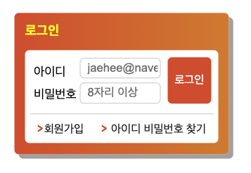
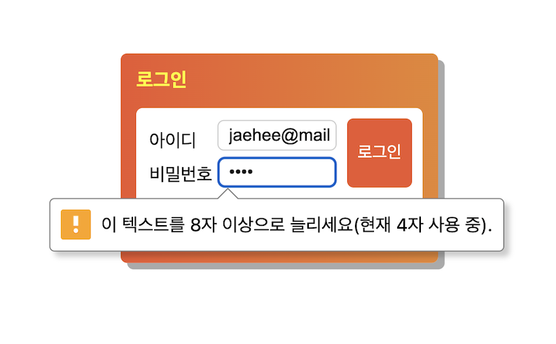

# 2차 과제

 
 

## HTML

- 로그인 폼 태그는 form 태그로 감싼 뒤 접근성을 고려하여 fieldset, legend 태그를 사용하여 로그인 폼 태크임을 명시하였습니다.
- required를 통해 반드시 아이디와 비밀번호 모두 입력하게 하였습니다.

- minlength를 이용하여 비밀번호를 최소 8자리 이상 입력 받게 하였습니다.

## CSS

- 로그인 버튼은 position: absolute에서 top과 left를 이용하여 배치하였습니다.
- 회원가입과 아이디 비밀번호 찾기는 float를 이용해 배치하였습니다.
- box-shadow를 통해 그림자를 구현했습니다.
