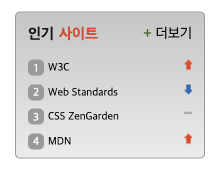

# sprite 활용하기

<p align="center"></p>

<br>

https://jay0425.github.io/home-work/mission-05/sprite

<br>

# html

```html
<div class="top">
  <div class="top-left"><span class="popular">인기</span><span class="site">사이트</span></div>
  <a href="#"><span class="cross">&plus;</span><span class="more">더보기</span></a>
</div>
```

- 전체적으로 두박스로 나누어 윗쪽을 'top' 아랫쪽을 'bottom'이라고 클래스명을 붙였습니다.

```html
<div class="bottom">
  <ol class="popular-sites">
    <li class="popular-site">
      <a href="#" target="_blank" data-tooltip="1" rel="noopener noreferrer">W3C</a>
      <div class="sprite sprite1"></div>
    </li>
    <li class="popular-site">
      <a href="#" target="_blank" data-tooltip="2" rel="noopener noreferrer">Web Standards</a>
      <div class="sprite sprite2"></div>
    </li>
    <li class="popular-site">
      <a href="#" target="_blank" data-tooltip="3" rel="noopener noreferrer">CSS ZenGarden</a>
      <div class="sprite sprite3"></div>
    </li>
    <li class="popular-site">
      <a href="#" target="_blank" data-tooltip="4" rel="noopener noreferrer">MDN</a>
      <div class="sprite sprite4"></div>
    </li>
  </ol>
</div>
```

- css의 before 가상 선택자에서 attr()을 활용하기 위해 각각의 a 태그에 data-tooltip을 주었습니다.
- a태그 클릭 시 새창이 열릴 때, 보안 이슈에 대비하여 rel 속성에 'noopener'와 'noreferrer' 값을 주었습니다.

<br>

# CSS

```css
.popular-site a::before {
  content: attr(data-tooltip);
  display: inline-flex;
  justify-content: center;
  align-items: center;
  width: 16px;
  height: 16px;
  background: #a3a3a3;
  border-radius: 5px;
  color: white;
  margin-right: 4px;
}
```

- 인기사이트 목록 앞에 숫자들을 나열하기 위해 attr()을 활용하였습니다.
- inline 속성은 유지하되 flex로 나열하기 위해 display: inline-flex를 사용했습니다.

```css
.sprite {
  background: url(./rank.png) no-repeat;
  padding-left: 0.5rem;
  height: 1rem;
}

.sprite1 {
  background-position: 0 0;
}

.sprite2 {
  background-position: 0 -45px;
}

.sprite3 {
  background-position: 0 -22.5px;
}

.sprite4 {
  background-position: 0 0;
```

- sprite를 활용하여 각각의 사이트 옆에 이미지를 주었습니다. sprite를 활용하면 하나의 자원만 불러와서 사용되기 때문에 리소스 낭비를 줄일 수 있습니다.
